# Media Login Services

This project demonstrates integrating multiple authentication methods:
- **Local login** with username & password  
- **GitHub login (OAuth)**  
- **Google login (OAuth)**  

It includes session management, error handling, secure handling of OAuth tokens, and a responsive login interface.

---

 🚀 Setup Instructions

 1. Clone repository
```bash
git clone https://github.com/JPretz/media-login-services.git
cd media-login-services

2. Install Dependencies
bash
Copy code
npm install

3. Configure environment variables

Copy .env.example → .env and add your credentials:

SESSION_SECRET=your-secret-key

# GitHub OAuth
GITHUB_CLIENT_ID=your-github-client-id
GITHUB_CLIENT_SECRET=your-github-client-secret
GITHUB_CALLBACK=http://localhost:3000/auth/github/callback

# Google OAuth
GOOGLE_CLIENT_ID=your-google-client-id
GOOGLE_CLIENT_SECRET=your-google-client-secret
GOOGLE_CALLBACK=http://localhost:3000/auth/google/callback

4. Run database migration
node migrate.js

5. Start the server
npm start

Your app will run at: http://localhost:3000


6. 🧪 Testing Authentication
🔹 Local Login

Invalid credentials →

🔹 GitHub Login

Denied access →

Successful login →

🔹 Google Login

OAuth consent screen →

Account chooser →

Invalid credentials →

Successful login →

Welcome page before logout →

After logout →

🔒 Security Features

Session persistence with express-session

Secure token handling using Passport strategies

Database storage for GitHub & Google IDs

Error messages for denied or failed logins

Environment variables (.env) used for client secrets

📄 Project URL

GitHub Repository: https://github.com/JPretz/media-login-services


📸 Screenshots / Testing Evidence

### Local Login
- Local login error: 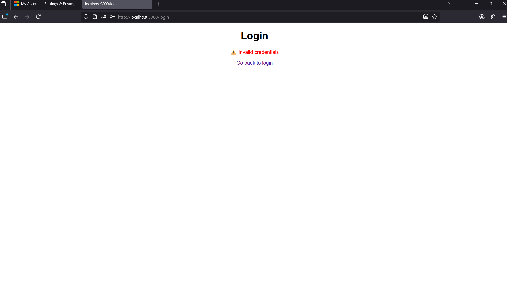
- Session persistence after login: 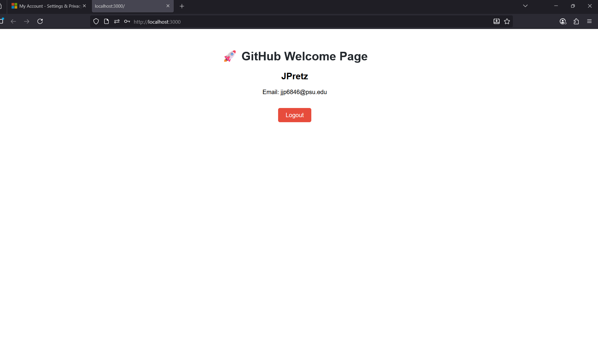
- Logout before action: 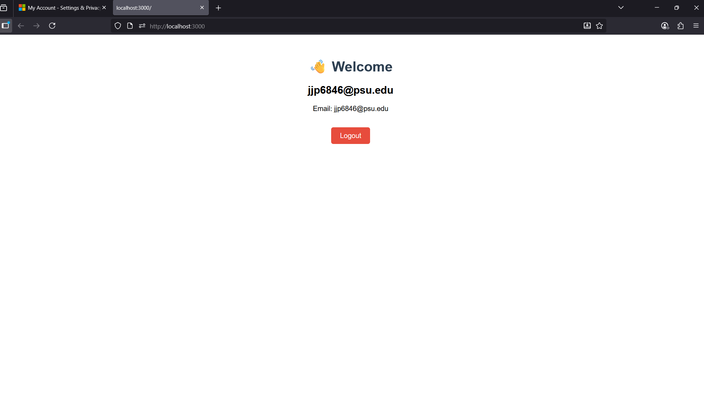
- Logout after action: 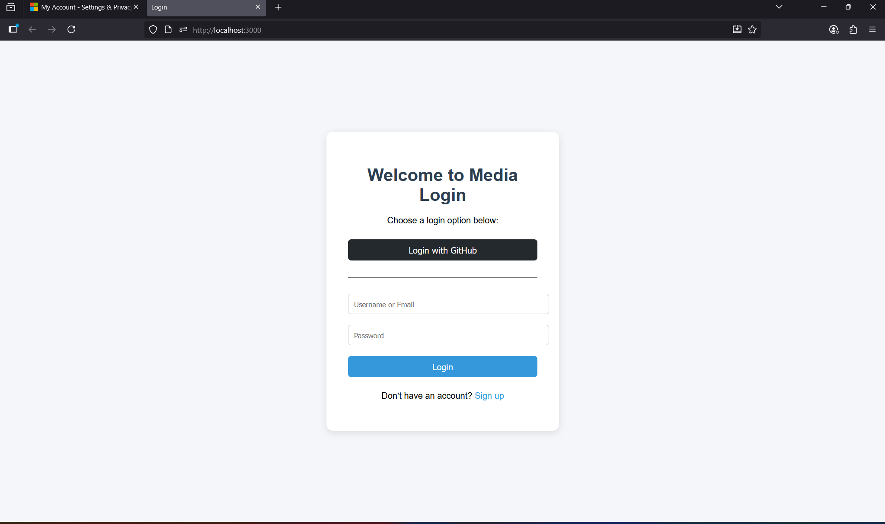

---

### GitHub Login
- GitHub login denied: 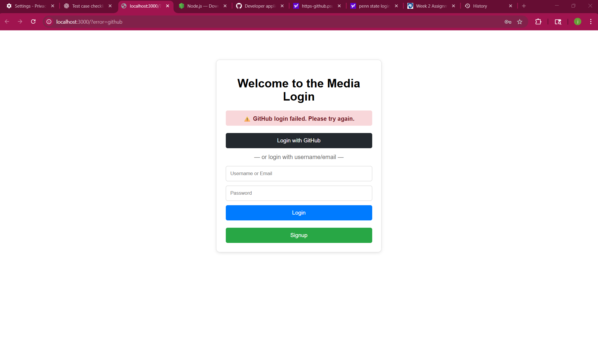
- GitHub login successful: 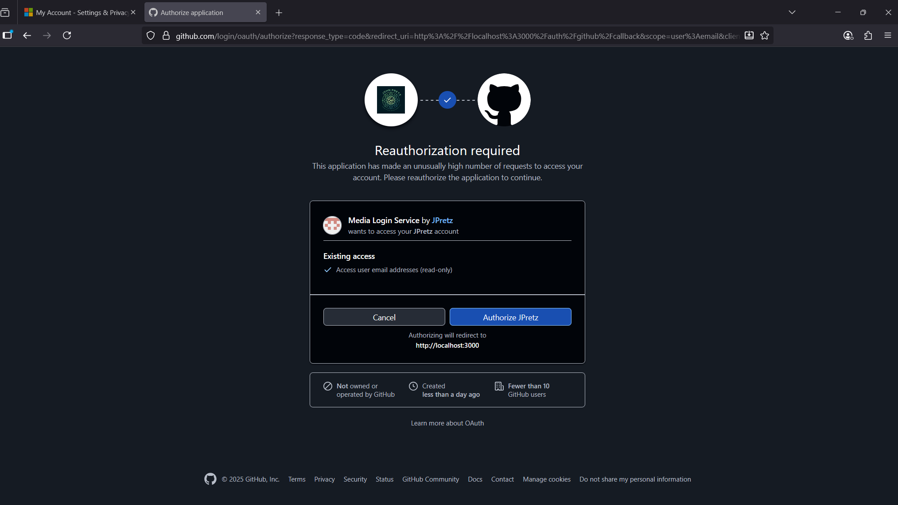

---

### Google Login
- Google login denied/cancelled: 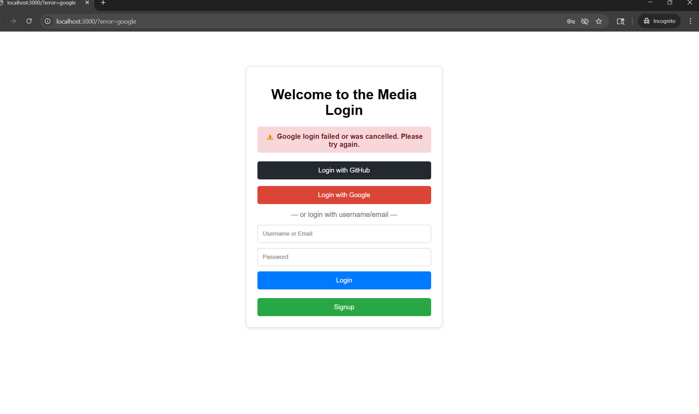
- Google login successful: 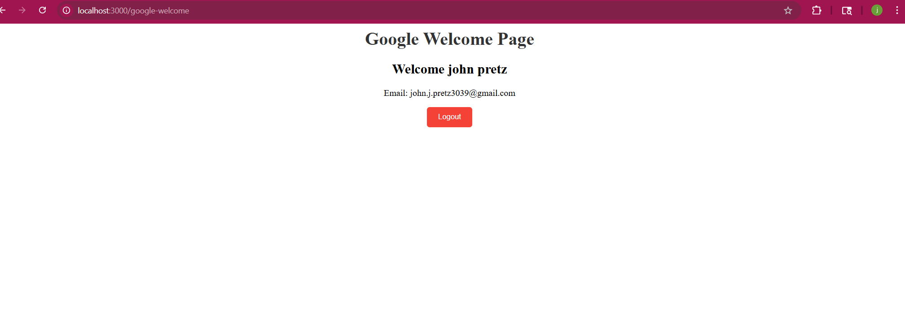
- Google account chooser: 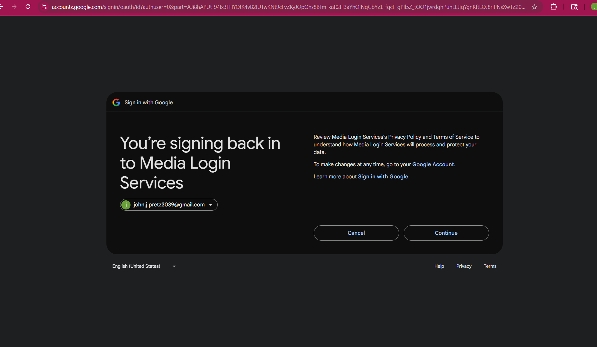
- Google OAuth 2.0 consent screen: 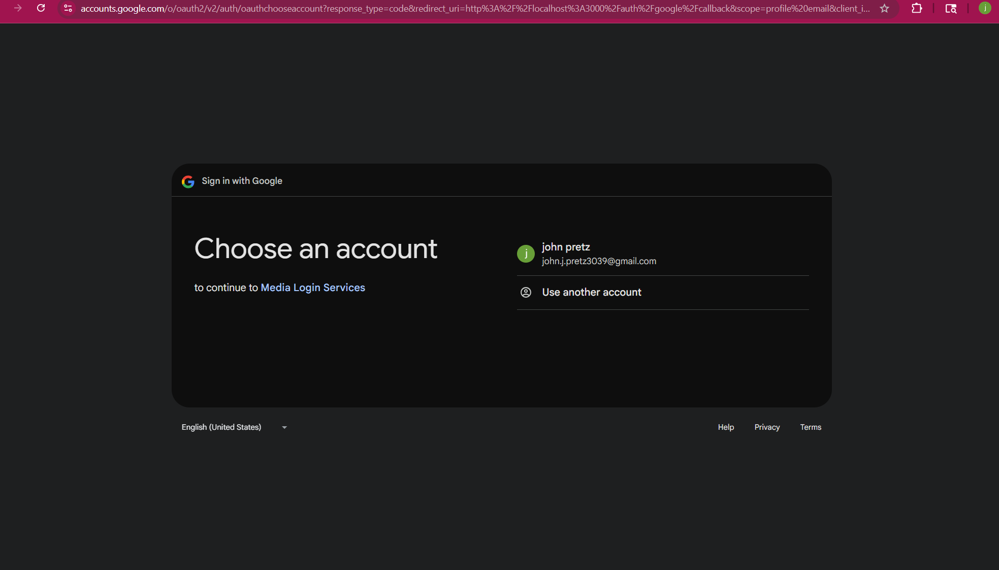
- Google welcome page before logout: 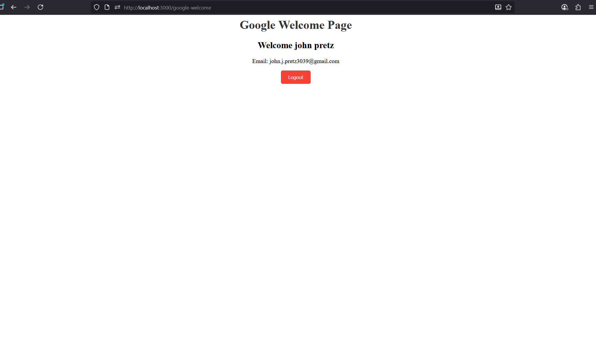
- Welcome page after logout: 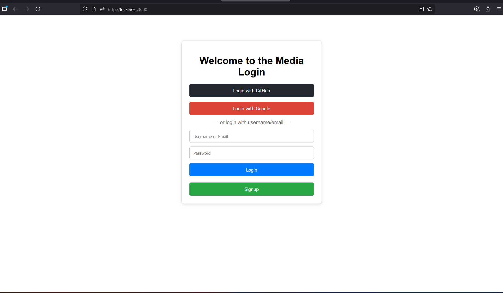


📦 Submission Details

Project Repo URL: https://github.com/JPretz/media-login-services

Included: Source code, .env.example, screenshots, README

Implements: Local + GitHub + Google OAuth login, session persistence, error handling